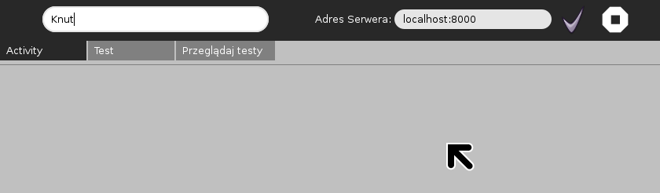
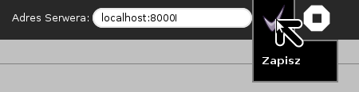
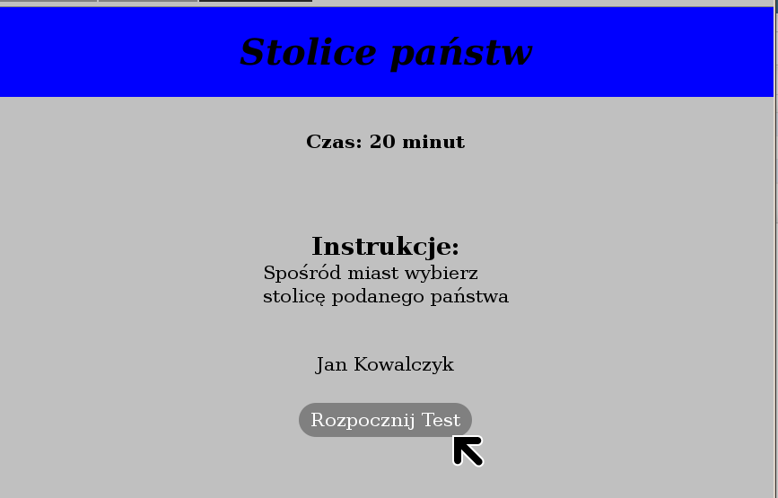
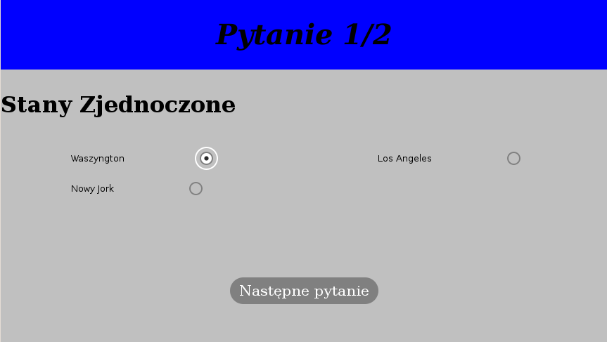

.. Podręcznik użytkownika programu Knut - aplikacji do rozwiązywania testów na platformie Sugar

Witamy w Podręczniku użytkownika programu Knut - aplikacji do rozwiązywania testów na platformie Sugar
=================================================================================================================

.. toctree::
   :maxdepth: 2

.. _wprowadzenie:

Wprowadzenie
============ 

Podręcznik ten jest przygotowany dla użytkowników rozwiązujących testy na platformie Sugar. Opisuje on wymagania, proces instalacji i użytkownia programu.

Aplikacja Knut to darmowe oprogramowanie służące do rozwiązywania testów udostępnionych poprzez serwer.
	
.. _wymagania-systemowe:
	
Wymagania systemowe
-------------------
	
Program wymaga zainstalowanej platformy Sugar w wersji 0.88 oraz połączenia internetowego (ewentualnie z siecią, w której znajduje się serwer udostępniający testy)

.. _instalacja-programu:

Instalacja programu
-------------------

Program Knut można zainstalować na 2 sposoby:

	*	przez stronę internetową np. knutest.org
	*	korzystając z terminala zainstalować program z dysku podłączonego przez USB lub kartę pamięci SD
	
Instalacja przez stronę internetową
+++++++++++++++++++++++++++++++++++

Sposób ten jest najwygodniejszy jednocześnie gwarantujący pobranie najnowszej wersji.

Aby zainstalować program należy:

	1.	Uruchomić przeglądarkę internetową
	2.	Przejść na stronę z programem np. http://knutest.org
	3. 	Kliknąć na link do pliku np. ``Knut-1.xo``
	4.	Potwierdzić chęć instalacji programu klikając przycisk ``OK`` na komunikacie, który się pojawi.

Po instalacji program do rozwiązywania testów Knut będzie dostępny z okna głównego środowiska Sugar.

Instalacja z dysku USB lub karty pamięci SD
+++++++++++++++++++++++++++++++++++++++++++

Należy wykonać następujące kroki:

	1.	podłączyć dysk USB lub kartę pamięci SD
	2.	z okna głównego uruchomić terminal
	3.	w wiersza poleceń wpisać:
	
.. code-block:: python

	sugar-install-bundle /media/<nazwa urządzenia>/Knut-1.xo

Gdzie <nazwa urządzenia> to nazwa dysku, którą można sprawdzić w programie dziennik, dostępnym z okna głównego Sugar.

.. _obsluga programu:

Obsługa programu
================

Program Knut uruchamiamy z widoku głównego środowiska Sugar. Bezpośrednio po instalacji może nie być on widoczny na domyślnym oknie dlatego może zajść potrzeba na otworzenie widoku listy. Aby zobaczyć wszystkie zainstalowane programy należy kliknąć na przycisk ``Widok listy`` (w prawym górnym rogu okna głównego).

Okno programu po uruchomieniu

Interfejs programu podzielony jest na 3 zakładki:

	*	``Activity`` - zakładka widoczna po uruchomieniu programu. Pozwala na ustawienie adresu serwera testów.
	*	``Test`` - tutaj udzielane są odpowiedzi. Jeśli znamy id testu, możemy bezpośrednio z tej zakładki rozpocząć rozwiązywanie testu.
	*	``Przeglądaj testy`` - pozwala na przeglądanie i wybór testu do rozwiązywania. Umożliwia wyszukiwanie testów na serwerze.
	
Program Knut nie zapisuje żadnych testów na dysku. Po rozwiązaniu testu odpowiedzi są odsyłane na serwer a pliki testu zostają usunięte.

|
|
|
|
|
|
|

Ustawienia programu
-------------------

Do rozpoczęcia pracy z programem niezbędne jest ustawienie adresu serwera, z którego rozwiązywać będziemy testy. W zakładce ``Activity`` należy uzupełnić pole ``Adres Serwera`` i kliknąć na przycisk potwierdzenia. Nie ma konieczności wprowadzania danych typu login lub hasło ponieważ program będzie przedstawiał się serwerowi jako użytkownik systemu wykorzystując ustawienia globalne środowiska Sugar.

Pole adresu serwera

Wybór testu do rozwiązania
--------------------------

Aby rozpocząć rozwiązywanie testu musimy go określić. Mamy dwie możliwości:

	*	Jeśli znamy ``id testu`` i ewentualne hasło możemy w zakładce ``Test`` wprowadzić posiadane dane i nacisnąć przycisk pobierania testu.

		Rozpoczęcie testu z zakładki ``Test``

		.. image:: images/PobierzTest.png
			:scale: 90%

	*	Mamy też możliwość przeglądania i wyszukiwania testów. W zakładce ``Przeglądaj testy`` możemy wyszukać interesujący nas test oraz zobaczyć jego instrukcje.
	
		Przeglądanie testów dostępnych na serwerze
		
		.. image:: images/PrzegladanieTestow.png
			:scale: 90%

		Aby rozpocząć rozwiązywanie testu musimy go zaznaczyć klikając na wiersz wybranego testu a następnie na przycisk ``Pobierz test``. Po pobraniu testu zostanie wyświetlony komunikat z potwierdzeniem, na którym należy kliknąć na przycisk ``OK``. Następnie zostanie wyświetlona pierwsza strona testu (nazwa, instrukcje)
		
Rozwiązywanie testu
-------------------

Pierwsza strona testu

Po pobraniu testu zostanie wyświetlona pierwsza strona testu. Zawiera ona tytuł testu, czas potrzebny do rozwiązania, instrukcje oraz imię i nazwisko autora testu.

Po kliknięciu przycisku ``Rozpocznij Test`` wyświetli się pierwsze pytanie.

Przykładowe pytanie

W górnej części ekranu wyświetla się bieżący numer i całkowita ilość pytań. Poniżej wyświetlona jest treść pytania i możliwe odpowiedzi. 

Program obsługuje następujące rodzaje pytań:

	*	jednokrotnego wyboru
	*	wielokrotnego wyboru
	*	prawda albo fałsz

Po zaznaczeniu odpowiedzi należy nacisnąć przycisk ``Następne pytanie``. Po udzieleniu odpowiedzi na ostatnie pytanie wyświetlony zostanie komunikat z wynikami testu. Wyniki i udzielone odpowiedzi odsyłane są na serwer i są dostępne dla użytkownika, który utworzył test.

Komunikat o wynikach

